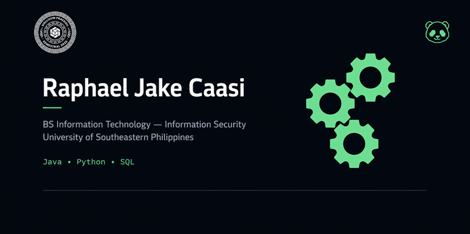

---

---

## ABOUT ME

  
I am currently building a strong foundation in software engineering through hands-on development, continuous learning, and real-world projects.
My interests span software engineering, cybersecurity, cloud computing, data engineering, artificial intelligence, and a little game development.
I focus on building systems that are secure, scalable, and practical.

---

## SYSTEM DEVELOPMENT

<table style="margin: 0 auto; text-align: left;">

<tr>
<th>Category</th>
<th>Tools</th>
</tr>

<tr>
<td><b>Languages</b></td>
<td>

</td>
</tr>

<tr>
<td><b>Database</b></td>
<td>

</td>
</tr>

<tr>
<td><b>Tools & Platforms</b></td>
<td>

</td>
</tr>

</table>

---

## CURRENT FOCUS

<table style="margin: 0 auto; text-align: left;">

<tr>
<th>Established</th>
<th>Building</th>
<th>Exploring</th>
</tr>

<tr>
<td>

Java  
Python  
MySQL  
Git & GitHub  
Linux Fundamentals  

</td>

<td>

Software Engineering Foundations  
Full-Stack Development  
API Development  
System Design Fundamentals  
HERMES  

</td>

<td>

Cloud Computing  
DevOps  
Cybersecurity  
Data Engineering  
Artificial Intelligence  
Game Development  

</td>
</tr>

</table>

---

## FEATURED PROJECT

<table style="margin: 0 auto; text-align: left;">

<tr>
<th>Title</th>
<th>Technology</th>
<th>Description</th>
<th>Notes</th>
</tr>

<tr>

<td valign="top">
<b>HERMES</b> 
<i>Human Employee Resource Management & Employment System</i>  

<a href="https://github.com/Serannette/HERMES">
View Repository →
</a>
</td>

<td valign="top">

</td>

<td valign="top">
A fully developed system that manages employee records, attendance, payroll, recruitment, government remittances, leave management, and performance evaluation in one platform.
</td>

<td valign="top">
Currently improving UI and fixing minor bugs.  
<b>Status:</b> Stable (Active Improvements)
</td>

</tr>

</table>

---

## AREAS OF INTEREST

<table style="margin: 0 auto; text-align: center;">

<tr>

<td width="25%">

### Software Engineering
Full-Stack Development  
Backend Systems  
System Design  
Scalable Applications  

</td>

<td width="25%">

### Cybersecurity
Secure Development  
Web Security  
Network Security  
Security Engineering  

</td>

<td width="25%">

### Cloud & DevOps
Cloud Computing  
Infrastructure  
Automation  
DevOps Practices  

</td>

<td width="25%">

### Data & AI
Data Engineering  
Machine Learning  
AI Systems  
Intelligent Applications  

</td>

</tr>

</table>

---

## CONNECT WITH ME

---

What we build today will shape the world of tomorrow; what we protect today ensures there is a future worth building.

